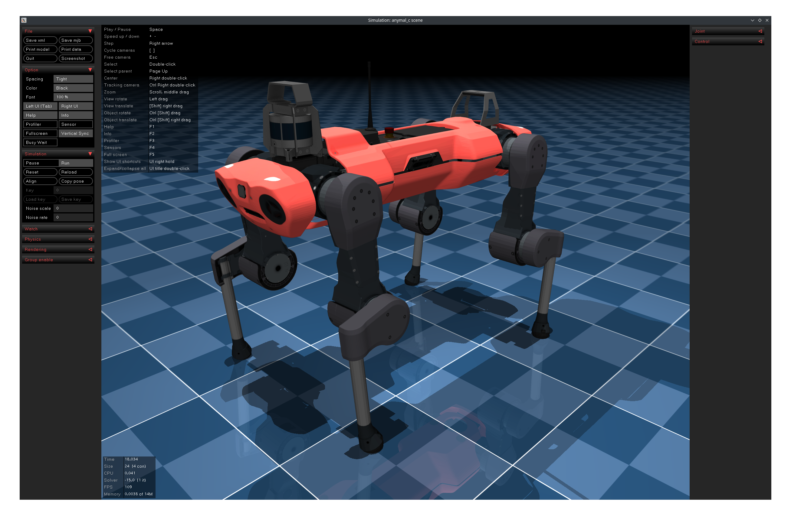

# MuJoCo ROS2

<div align="center">
    
</div>

## Introduction

This package is developed with [ROS2](https://docs.ros.org/en/humble/index.html) as a fork of [Spot MuJoCo ROS2](https://github.com/MindSpaceInc/Spot-MuJoCo-ROS2) with the aim to be a general ROS2 MuJoCo wrapper.

Comparing to the original repo, this fork includes:
+ feet contact callback
+ JointTrajectory callback to control the robot
+ odometry callback
+ parameters to time the callbacks
+ ANYmal C XML description

## Installation

```
# Create your own workspace
cd ~/ & mkdir -p your_workspace/src
```

```
# Clone this package to your_workspace/src
cd ~/your_workspace/src & git clone git@github.com:mlisi1/Spot-MuJoCo-ROS2.git
cd ..
```

```
# Build (DO NOT remove `--symlink-install`)
colcon build --symlink-install 
```

```
# Setup env
source install/setup.bash
```

```
# Run simulation 
ros2 launch mujoco anymal_simulation.launch.py
```
## Published topics
Using the command `ros2 topic list` the following topics can be seen during simulation:
```
# already present
/simulation/actuators_cmds
/simulation/imu_data
/simulation/joint_states
/simulation/odom
/simulation/rgb_image
/simulation/depth_image
/simulation/imu_data
/simulation/touch_sensor

# new topics
/simulation/joint_trajectory        # used to control the robot
/simulation/contacts                # publishes all contacts
/simulation/sensor_odom             # publishes Odomtry message regarding a specific frame

```
It is worth noting that it is useful to give names to the interested geometries for collision. The simulation will publish every collision happening; as usually geometries do not have a name, they will show as Unnamed, so indistinguishible.
